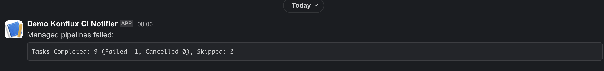

# konflux-release-example 

This repository demonstrates how to set up and release an application using Konflux-CI on Kind. Before begining I would recommend reading the [Konflux-CI release documentation](https://konflux-ci.dev/docs/releasing/) before trying this demo.

We will be running three pipelines:
- [Tenant Pipeline](/pipelines/tenant-pipeline.yaml) pipeline defined in the ReleasePlan.
- [Managed Pipeline](https://github.com/konflux-ci/release-service-catalog/blob/0cbe8aebf8b85763b724dc292641d2c587f13b6e/pipelines/managed/push-to-external-registry/push-to-external-registry.yaml) defined in the ReleasePlanAdmission. This pipeline will push images to push-to-external-registry (quay).
- [Final Pipelinel](https://github.com/konflux-ci/community-catalog/blob/production/pipelines/notify-slack-on-failure/notify-slack-on-failure.yaml) defined in the ReleasePlan. This pipeline will notify Slack on failure if the managed pipeline fails.
## Screenshots


*Tenant Pipeline*


*Managed Pipeline*


*Final Pipeline*

## Initial Setup
Start by following the instructions at [Konflux-CI Bootstrapping](https://github.com/konflux-ci/konflux-ci#bootstrapping-the-cluster) up to step 3.  
This will prepare you for making a test release.

<details>
    <summary>Copied from Konflux-CI Doc</summary>

```bash
git clone https://github.com/konflux-ci/konflux-ci.git && cd konflux-ci
```
```bash
kind create cluster --name konflux --config kind-config.yaml
```
```bash
podman update --pids-limit 4096 konflux-control-plane
```
```bash
./deploy-deps.sh
```
```bash
./deploy-konflux.sh
```

</details>

## Add Secrets

Move `example-secrets` into `secrets` and replace the example values for each file.
```bash
mv example-secrets secrets
```
A release requires certain secrets depending on the pipelines you are using.
Here are the required secrets for the demo release:
- **.dockerConfig**:
  This allows Konflux to push images to your Quay repository.
  You will need a repository that is public.
  Create a robot account on Quay with write permissions and copy the generated JSON file.
  You can find documentation on how to create a robot account in [Quay documentation](https://docs.redhat.com/en/documentation/red_hat_quay/3/html/managing_access_and_permissions/allow-robot-access-user-repo#creating-robot-account-v2-ui).

- **.publicKey**:  
  This is the public key for your image signing key pair.  
  It is used to verify the signatures of container images.  
  Ask @seanconroy2021 for the public key.

- **.slackWebhook**:
  *Note: This step can be skipped just use the example webhook URL.*  
  This is the webhook URL for your Slack channel.  
  It is used to send notifications to Slack.
  You can find a setup guide for Slack webhooks in the [Slack API documentation](https://api.slack.com/messaging/webhooks).
  

## Update the releasePlanAdmissions.yaml file

- Replace `<quay.io/sconroykonflux/hello-world>` with your actual Quay repository name, e.g. `quay.io/sconroykonflux/hello-world`.

This is where the container images will be pushed.

## Apply All Resources

Apply all resources to your cluster:
```bash
oc apply -k .
```
This will create the necessary resources to be able to run a release.

## Checking Resources
After applying, verify that resources have been created:

- **Snapshot**:  
  ```bash
  oc get snapshot -n user-ns2
  NAME                   AGE
  hello-world-snapshot   <12m>
  ```

- **ReleasePlan (rp)**:  
  ```bash
  oc get rp -n user-ns2
  NAME                           APPLICATION       TARGET
  hello-world-app-release-plan   hello-world-app   managed-ns2
  ```

- **ReleasePlanAdmission (rpa)**:  
  ```bash
  oc get rpa -n managed-ns2
  NAME                                     ENVIRONMENT   ORIGIN
  hello-world-app-release-plan-admission                 user-ns2
  ```

## Ready to Release

Currently the example release plan is configured with ` release.appstudio.openshift.io/auto-release: 'false'`, which means you will need to create a manual Release custom resource (CR).
To trigger a release, apply the release manifest:
```bash
oc apply -f release.yaml
```

## Monitoring the Release

You can monitor the release progress in the konflux-ui:  
https://localhost:9443/ns/user-ns2/applications/hello-world-app/releases

- Username: user2@konflux.dev
- Password: password

*You can find more info at step 6 [Konflux-CI Bootstrapping](https://github.com/konflux-ci/konflux-ci#bootstrapping-the-cluster).*


*Pipeline Runs*

Or check the release status via CLI:
```bash
oc get release hello-world-release -n user-ns2 -o yaml
```

After the release completes successfully, check your Quay repository for a new images.

You can also view what you have just pushed to Quay in the Konflux-ui under release artifacts.


*Release Artifacts*

## How to re-run a release

You can re-run a release via the Konflux-ui but for the demo you can simply delete the existing Release custom resource (CR) and apply the release manifest again:
```bash
oc delete release hello-world-release -n user-ns2
oc apply -f release.yaml
```

## How to make the managed pipeline fail to see a slack notification

To test the Slack notification for a failed release, you can introduce a deliberate error in your pipeline. 

For example, you can modify the `releasePlanAdmissions.yaml` file to use an incorrect repository name e.g. from `quay.io/sconroykonflux/hello-world` to `<quay.io/sconroykonflux/hello-world>`

Once you've made the change, re-apply the resources `oc apply -k .` and re-run the release using the steps outlined in the "How to re-run a release" section. If the release fails, you should see a notification in your Slack channel.


*Failed Managed Pipeline*


*Slack Notification*

## Additional Documentation

- [Configuring a release](https://github.com/konflux-ci/konflux-ci?tab=readme-ov-file#configure-releases)
- [Releasing](https://konflux-ci.dev/docs/releasing/)

## Questions

If you have any questions or feedback, please reach out on [Slack](https://redhat.enterprise.slack.com/archives/C031USXS2FJ). Feel free to submit an issue or pull request on GitHub.
